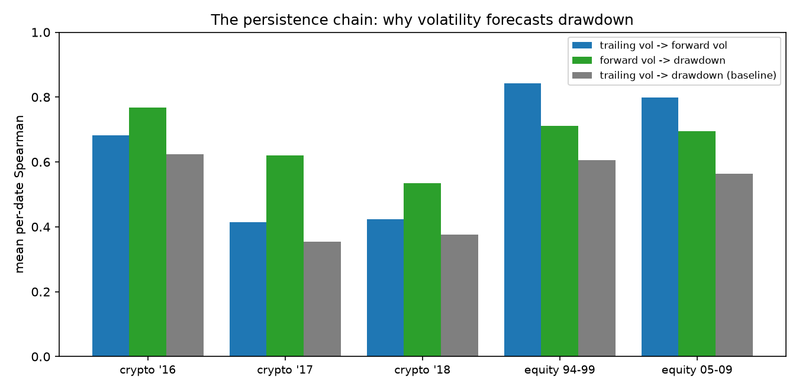
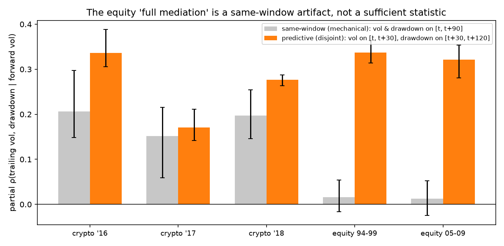
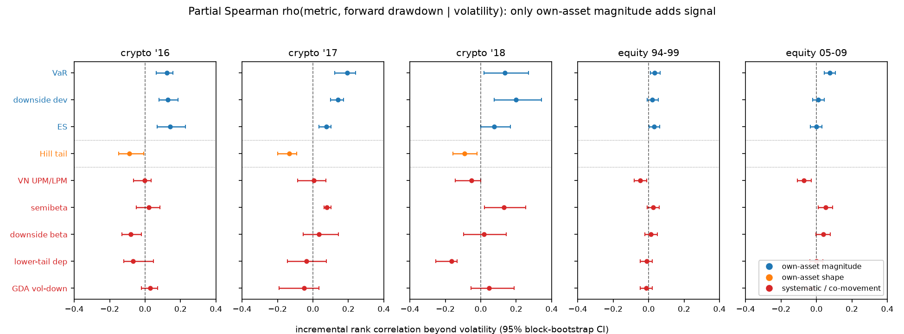
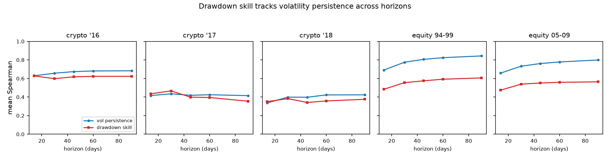
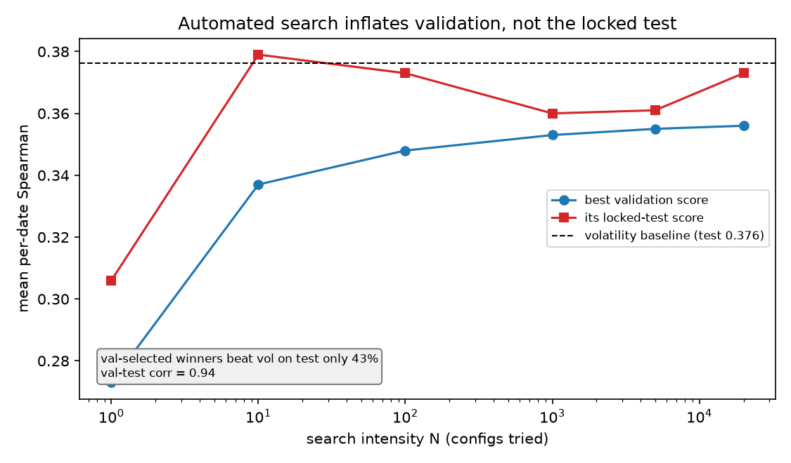
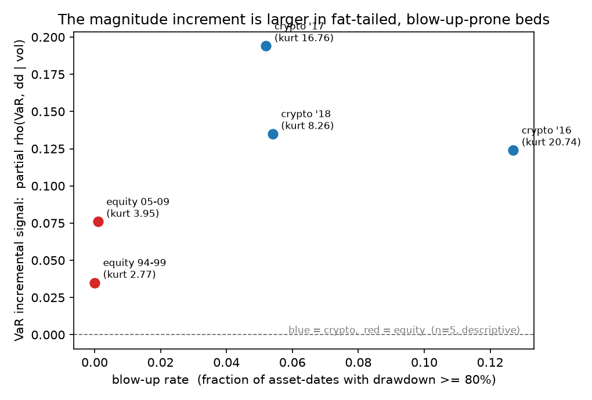
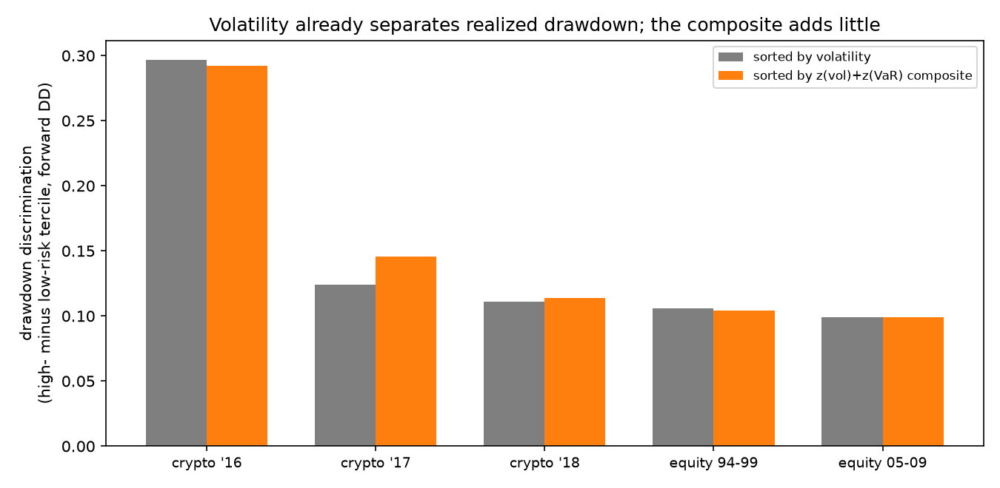

# Magnitude, Not Shape: A Survivorship-Free, Significance-Tested Evaluation of Downside-Risk Metrics

**Working paper — draft, revision 4 (2026-07-18). Target: a workshop / short-paper venue
(e.g. an ICAIF-affiliated or NeurIPS/ICML "ML for finance" workshop) + arXiv.**
All results reproduce from `src/` and `outputs/`; every number traces to
`context/findings.md`. Published-metric implementations are daily-data adaptations,
not exact replications, and the return-pricing metrics are *repurposed* here as
drawdown forecasters (see §3, §6). References verified against publisher records.

## Abstract

Dozens of downside- and tail-risk metrics have been proposed as improvements over
plain return volatility. On a survivorship-free, multi-regime, **multiple-testing-corrected**
benchmark of ten metrics across five test beds (crypto retaining delisted coins, plus
equity), we ask which — if any — beats plain volatility at forecasting an asset's forward
drawdown, and decompose what is left to forecast *beyond* volatility. Our central,
correction-robust finding is a sharp split by *what a metric measures*: tail-**magnitude**
measures (VaR, expected shortfall, downside deviation) carry a small but genuine incremental
signal beyond volatility — VaR's partial rank correlation survives Benjamini–Hochberg
correction on **all five beds** (partial ρ up to 0.19) — whereas tail-**shape** measures —
asymmetry, tail heaviness, and co-crash structure, including the Viole–Nawrocki partial-moment
ratio that motivated this study — carry **none** (partial ρ ≈ 0 or negative everywhere). The
forecastable residual beyond volatility is the *size* of tail losses, not their *asymmetry*.
A single pre-registered, zero-tuning composite `z(vol)+z(VaR)` bounds the ceiling: it beats
volatility on exactly one bed (the most fat-tailed crypto regime) and is neutral-to-worse
elsewhere, with a non-significant locked-holdout test. Why is volatility so hard to beat? It
is highly persistent, so trailing volatility already forecasts the forward volatility that
governs drawdown; we quantify this but also show, via a *predictive* (non-overlapping)
mediation test, that forward volatility is **not** a sufficient statistic — trailing
volatility retains direct forecasting content — so volatility persistence is a leading but
*incomplete* explanation, not a mechanism that reduces drawdown to a single quantity. Two
corroborating results follow naturally:
(i) an autonomous LLM autoresearch loop and a 20,000-config search inflate *validation*
skill with search intensity while the *locked-test* score plateaus at volatility —
precisely because there is little incremental signal to find; and (ii) volatility is a
useful survivorship-free *blow-up* predictor (ROC-AUC 0.68 at a −80% cutoff, 0.95 at −90%).
The methodological lesson for AI-in-finance: automated metric discovery needs a locked,
ideally survivorship-free holdout, because the incremental signal it chases is scarce.

## 1. Introduction

A large literature proposes downside- and tail-risk metrics — semi-variance, VaR,
expected shortfall, downside beta, semibetas, tail dependence, partial-moment ratios
— as refinements over symmetric volatility for capturing what investors actually fear:
large losses. This study began as an audit of one such metric, Viole & Nawrocki (2016),
whose partial-moment "predictive" ratio proved to have an inert autocorrelation term
and a survivorship-inflated edge. That raised a sharper, more general question: on a
level field — survivorship-free data, a locked holdout, multiple regimes, significance
tests — does *any* downside-risk metric beat plain volatility at forecasting an asset's
tail risk, and if not, **why not**?

We answer both. The benchmark answer is negative and unsurprising in hindsight: no
metric, published or machine-discovered, reliably beats volatility. The value of the
paper is in *what survives* a hardened evaluation — a correction-robust decomposition of
where the scarce incremental signal lives, and an honest account of why volatility is
hard to beat.

**Contributions.** (1) *A magnitude-vs-shape decomposition, robust to multiple testing.*
Using partial rank correlations we show the only incremental signal beyond volatility comes
from tail *magnitude* (VaR/ES/downside deviation), not tail *shape* (asymmetry, tail
heaviness, co-crash) — the shape premise underlying partial-moment metrics carries no
incremental out-of-sample information. VaR's increment survives Benjamini–Hochberg
correction on all five beds; the increment scales with tail fatness (§4.2). (2) *A
survivorship-free, multi-regime, FDR-corrected benchmark* of ten metrics, plus a
pre-registered zero-tuning composite that bounds how far the increment goes (§4.4, §4.5).
(3) *An honest account of why volatility is hard to beat.* Volatility is highly persistent
(Engle, 1982; Bollerslev, 1986), so trailing volatility already forecasts the forward
volatility that governs drawdown; but a *predictive* (non-overlapping) mediation test shows
forward volatility is **not** a sufficient statistic — an earlier same-window test overstated
this — so persistence is a leading but incomplete explanation (§4.1, §4.3). (4) *Two
corroborations*: automated LLM-driven discovery finds no reliable incremental signal (a
data-snooping cautionary tale, §4.6), and volatility is a useful survivorship-free blow-up
predictor (§4.7). We do not claim a new market-beating metric; our attempts, including a
discovery loop, failed to beat volatility once guardrails were in place.

## 2. Test beds and protocol

**Five test beds, calm and crash, two asset classes.** *Crypto (survivorship-free):*
a CoinMarketCap daily panel (2013–2018) that retains crashed/delisted coins, so a
point-in-time top-100-by-market-cap universe includes assets that later crater; three
regimes — **2016 (calm)**, **2017 (bull)**, **2018 (crash)**. *Equity:* S&P 500
constituents (yfinance), two regimes — **1994–1999 (calm bull, 66 months)** and
**2005–2009 (GFC, 54 months)**. The equity beds are survivorship-*biased* by
construction (free equity retains almost no true deaths — itself a finding); they test
cross-asset generality of the ranking, **not** the survivorship claim, which rests on
the crypto beds.

**Skill measure and significance.** From a 180-day trailing window we forecast 90-day
forward maximum drawdown (delisting scored −100%); skill is the per-formation-date
cross-sectional Spearman correlation, averaged over the bed. Every reported quantity
carries a **paired block-bootstrap 95% CI**. Because the benchmark spans ~45 metric×bed
cells, we do not rely on nominal CIs alone: the significance flags in the incremental
decomposition (§4.2) and the head-to-head table (§4.4) are corrected for multiple testing
with **Benjamini–Hochberg (q = 0.05)** within each family, and we report per-bed
minimum-detectable-effect and leave-one-date-out checks on the thin crypto beds (§4.2). For
the incremental decomposition (§4.2) we compute the **partial Spearman** correlation of each
metric with forward drawdown *controlling for volatility*, from the three pairwise rank
correlations.

**Machine discovery** (§4.6) uses a strict train/validation/**locked-test** split: the
search optimizes validation; the test is scored once, after the metric is frozen.

## 3. Metrics

The metrics descend from a long lower-partial-moment lineage — Markowitz semi-variance,
formalized by Bawa (1975) and Fishburn (1977), operationalized by Sortino & van der Meer
(1991), and repackaged as a predictive ratio by Viole & Nawrocki (2016) — whose shared
premise is that the *asymmetry/shape* of the loss distribution is separately informative.
That premise is exactly what we test. We group ten metrics by *what they measure*, because
the grouping is the finding:
- **Tail magnitude (volatility family):** volatility (baseline); downside deviation;
  5% VaR; 5% ES (Rockafellar & Uryasev, 2000; used as a left-tail predictor by Atilgan et
  al., 2020). These summarize the *size* of dispersion/losses. (VaR and ES are quantile/tail
  measures rather than dispersion per se, but empirically move with dispersion; the family
  label is about *magnitude vs shape*, and our conclusion is robust to reassigning them.)
- **Tail shape / co-movement:** Viole–Nawrocki UPM/LPM ratio (asymmetry);
  Bollerslev–Patton–Quaedvlieg negative semibeta; Ang–Chen–Xing / Levi–Welch downside
  beta; Chabi-Yo et al. lower-tail dependence; Farago–Tédongap volatility-downside
  (a generalized-disappointment-aversion, "GDA", proxy); a per-asset Hill loss-tail
  exponent (in the spirit of Kelly & Jiang, 2014, who instead estimate a *pooled*
  cross-sectional exponent). These target the *shape* of the loss distribution or co-crash
  structure, and several were built to *price returns*, not forecast drawdown — they are
  **repurposed** here.

All implementations are daily adaptations (an appendix documents each estimator and its
fidelity trade-off). Results for the pricing measures should be read as "does this
construct, operationalized comparably, forecast drawdown," not as a verdict on the
originals' pricing claims. The per-asset Hill exponent is not estimable per date on the
equity beds (too few tail observations) and is reported only where estimable.

## 4. Results

### 4.1 Why volatility is hard to beat — persistence, and its limits

Why does trailing volatility forecast forward drawdown so well that little else adds to
it? A large part of the answer is that volatility is *persistent* — the founding stylized
fact of the ARCH/GARCH literature (Engle, 1982; Bollerslev, 1986) and of realized-volatility
forecasting (Andersen et al., 2003). Trailing volatility forecasts forward volatility (rank
correlation 0.42–0.84 across beds, Table M2, all CIs exclude 0), and forward realized
volatility is in turn strongly related to forward drawdown (0.53–0.77). Both links exceed the direct trailing-volatility→drawdown skill they
compose.

| Test bed | trailing vol → forward vol | forward vol → drawdown* | (trailing vol → drawdown) |
|---|---|---|---|
| crypto-16 calm | **0.68** | 0.77 | 0.62 |
| crypto-17 bull | **0.42** | 0.62 | 0.36 |
| crypto-18 crash | **0.42** | 0.53 | 0.38 |
| equity 94–99 | **0.84** | 0.71 | 0.61 |
| equity 05–09 GFC | **0.80** | 0.70 | 0.56 |

*Table M2. Persistence chain (mean per-date cross-sectional Spearman; all CIs exclude 0).
\*The forward-vol→drawdown column is measured contemporaneously (both over the same forward
window) and is therefore partly mechanical — forward maximum drawdown is a functional of the
same forward path whose dispersion is forward volatility (Magdon-Ismail et al., 2004). The
genuinely predictive link is trailing→forward volatility.*

*Figure 2. The two links of the chain relative to the direct trailing-vol→drawdown skill.*

**But forward volatility is not a sufficient statistic.** A natural stronger claim is that
volatility persistence *fully* accounts for drawdown predictability — i.e., once you know
the forward volatility environment, trailing volatility adds nothing. A same-window mediation
test appears to support this (controlling for forward volatility, the partial ρ of trailing
volatility with drawdown falls to ≈ 0 on equity). **That result is an artifact**: because
forward volatility and forward drawdown are computed over the *same* window, conditioning on
the former mechanically absorbs the latter. When we instead measure the mediator on a
*disjoint, earlier* window — forward volatility over days 1–30, drawdown over days 31–120 —
so that it is genuinely *predictive*, the mediation disappears: the partial ρ(trailing vol,
drawdown | forward vol) is **+0.34 / +0.32 on the two equity beds** (and +0.17–0.34 on
crypto), essentially as large as the raw skill (Figure 3). Trailing volatility retains
substantial direct forecasting content that a short-horizon volatility forecast does not
capture. We therefore report volatility persistence as a **leading but incomplete
explanation** for why volatility is hard to beat — not a mechanism that reduces drawdown to a
single quantity.

*Figure 3. Partial ρ(trailing vol, drawdown | forward vol). Under the same-window
(mechanical) design the equity value is ≈ 0, suggesting full mediation; under the predictive
(disjoint-window) design it is +0.32–0.34 — trailing volatility is not screened off, so
forward volatility is not a sufficient statistic.*

### 4.2 Magnitude, not shape: what little is left beyond volatility

If volatility already captures the persistence chain, does any metric add signal
*beyond* volatility? Figure 1 plots the partial Spearman ρ(metric, drawdown | volatility)
— the incremental signal beyond volatility — for every metric across the five beds, with
95% block-bootstrap confidence intervals. The pattern is sharp and consistent across
regimes and asset classes, and splits cleanly by metric type (exact values in Appendix
Table A1).

*Figure 1. Incremental signal beyond volatility, by bed. Tail-magnitude metrics (blue)
sit to the right of zero, especially in crypto; tail-shape metrics (red) cluster at or to
the left of zero. Points are partial ρ; whiskers are 95% block-bootstrap CIs; the dotted
line separates the two metric families.*

The tail-**magnitude** measures (blue) carry a small but genuine incremental signal, and
it survives multiple-testing correction: applying Benjamini–Hochberg (q = 0.05) across the
43-cell partial-correlation family, **VaR's increment survives on all five beds**, downside
deviation on the three crypto beds, and ES on two crypto beds; the one equity ES cell that
was nominally significant does *not* survive FDR. The increment is small (partial ρ ≤ 0.20,
mostly ≤ 0.10) and largest in crypto. The tail-**shape** measures (red) carry essentially
none: the Viole–Nawrocki asymmetry ratio, the Hill tail exponent, lower-tail dependence, and
the GDA proxy are all ≈ 0 or significantly *negative* on every bed. The one shape-family
exception is negative semibeta, with a small FDR-surviving positive increment on three beds —
plausibly because a co-crash *magnitude* leaks into it. **The forecastable residual beyond
volatility is the *size* of tail losses, not their *asymmetry*** — which is exactly the
premise partial-moment and tail-shape metrics rest on.

**Power on the thin crypto beds.** The crypto beds have only 7–9 formation dates, so we check
the magnitude increment is not a small-sample mirage. For VaR: on crypto-16 (n = 8) and
crypto-17 (n = 9) the effect (0.12, 0.19) exceeds the minimum detectable effect at 80% power
(0.09, 0.09) and is stable under leave-one-date-out (ranges [0.11, 0.14], [0.17, 0.21]); on
crypto-18 (n = 7) the effect (0.13) is *below* its MDE (0.18) and should be read as
suggestive, though leave-one-date-out stays positive ([0.10, 0.18]). Conversely, the null
"shape adds nothing" claims are limited by the same power on crypto; on the well-powered
equity beds (54–66 dates) the shape metrics are cleanly ≈ 0 or negative, which is the stronger
evidence for that claim.

**Why is the increment larger in crypto?** The magnitude increment scales with how
fat-tailed and blow-up-prone a bed is: the crypto beds (trailing excess kurtosis 8–21,
blow-up rate 5–13%) show VaR increments of 0.12–0.19, versus 0.03–0.08 on the equity
beds (kurtosis 3–4, blow-up rate ≈ 0%) — Figure 6. With only five beds this is
descriptive, but the direction is consistent: tail magnitude matters more precisely where
tails are fat.

### 4.3 Dynamics: drawdown skill tracks volatility persistence across horizons

If volatility persistence is the leading explanation for drawdown predictability, the two
should move together as the forecast horizon changes. They do (Figure 4). Sweeping the
horizon from 14 to 90 days, volatility persistence and drawdown skill rise together on the
equity beds (persistence 0.66→0.84, skill 0.47→0.61, at a roughly constant gap) and are
jointly flat on crypto. Wherever persistence is higher, so is skill — consistent with
volatility persistence driving most of the forecastable variation, while the roughly
constant gap between the curves is the part persistence does not explain (§4.1).

*Figure 4. Volatility persistence (blue) and drawdown-forecast skill (red) vs horizon,
by bed. The curves track.*

### 4.4 Head-to-head benchmark

Table 2 gives the standalone head-to-head ranking, each metric vs volatility.

| Metric | crypto-16 | crypto-17 | crypto-18 | equity 94–99 | equity 05–09 |
|---|---|---|---|---|---|
| **volatility** (baseline) | 0.623 | 0.355 | 0.376 | 0.606 | 0.564 |
| downside deviation | 0.615 | **0.379\*** | 0.410 | 0.582† | 0.535† |
| VaR5 | 0.611† | **0.400\*** | 0.362 | 0.580† | 0.540† |
| ES5 (Atilgan) | 0.623 | 0.351 | 0.327† | 0.581† | 0.522† |
| neg. semibeta (BPQ) | 0.400† | 0.257† | 0.309† | 0.487† | 0.462† |
| downside beta (ACX/LW) | 0.014† | 0.093† | 0.151† | 0.242† | 0.344† |
| lower-tail dep. (Chabi-Yo) | −0.376† | −0.154† | −0.285† | −0.065† | −0.046† |
| vol-downside (Farago–Téd.) | −0.055† | −0.105† | −0.050† | −0.243† | −0.321† |
| UPM/LPM (Viole–Nawrocki) | −0.549† | −0.276† | −0.346† | −0.426† | −0.424† |

*Table 2. Standalone OOS drawdown-forecast Spearman. \* = significantly beats volatility;
† = significantly worse; unmarked = indistinguishable. Significance flags survive BH-FDR
(q = 0.05) across the 45-cell family: only downside deviation and VaR5 on crypto-17 beat
volatility; every shape metric is significantly worse on every bed.*

The only standalone wins over volatility, on any bed, are two magnitude metrics
(downside deviation, VaR5) on the single crypto-bull bed, and they **reverse on
equity**. This is **not a contradiction** with the partial correlations (Figure 1 /
Appendix Table A1): VaR5 has a significant *incremental* signal on equity yet loses
*standalone* on equity (Table 2), because as a standalone ranker it is a noisier proxy for
the volatility it mostly re-expresses. "Adds signal beyond volatility" and "beats volatility
on its own" are different questions — the partial-correlation decomposition separates them.

### 4.5 An honest composite: how far the increment goes

The decomposition has a concrete, testable upshot: a volatility-plus-tail-magnitude signal
should beat volatility, but only a little and only where tails are fat. We test the single
composite this implies — `comp = z(volatility) + z(VaR)`, equal weight, **with no fitting
and no free parameter tuned**. We are careful about what this does and does not guarantee:
the *weights* are fixed a priori, but the *variable* (VaR, over ES or downside deviation)
was chosen because it was the magnitude metric that survived correction on all five beds in
§4.2 — an in-sample selection over the same data. So the fully out-of-sample evidence is the
**locked-panel test**, scored once; the per-bed comparisons should be read as descriptive.

| Test bed | volatility ρ | composite ρ | difference (95% CI) |
|---|---|---|---|
| crypto-16 calm | 0.623 | 0.621 | −0.00 (n.s.) |
| crypto-17 bull | 0.355 | 0.402 | **+0.047 [0.023, 0.071]** |
| crypto-18 crash | 0.376 | 0.390 | +0.01 (n.s.) |
| equity 94–99 | 0.606 | 0.598 | −0.008 [−0.011, −0.004] (worse) |
| equity 05–09 | 0.564 | 0.562 | −0.00 (n.s.) |

*Table 3. Pre-registered `z(vol)+z(VaR)` vs volatility. Significant only in the fat-tailed
crypto-bull bed; slightly negative in thin-tailed equity. Locked panel test: 0.376 → 0.388,
Newey-West t = 0.67 (7 dates, n.s.).*

The fully out-of-sample result is the locked-panel test, and it is **not significant**
(0.376 → 0.388, Newey–West t = 0.67, 7 dates). Across beds the composite beats volatility on
exactly one — crypto-2017, the most fat-tailed regime — and is neutral-to-*significantly
worse* on thin-tailed equity, where adding a noisy VaR only degrades the volatility signal.
This is the honest ceiling on "beating volatility": at most a small, regime-specific edge
where tail magnitude carries signal, with no out-of-sample gain that clears significance. It
is not a general-purpose better metric, and we did not tune it into one.

### 4.6 Automated discovery finds no incremental signal (corroboration)

Because the incremental signal beyond volatility is small (§4.2), an automated search
should be unable to find a metric that reliably beats volatility out of sample — and
should instead overfit validation. It does. We built a Karpathy-style autoresearch loop:
an LLM agent freely rewrites a single `metric.py`; a frozen scorer evaluates it on
validation; improvements are kept; the discovery is scored once on the locked test. A
20,000-config directed search makes the phenomenon unambiguous (Table 1): the best
*validation* score rises monotonically with search intensity while the *locked-test*
score plateaus at the volatility baseline.

| Search intensity N | Best validation | Its locked test |
|---|---|---|
| 1 | 0.27 | 0.31 |
| 100 | 0.35 | 0.37 |
| 20,000 | **0.356** | **0.373** (vol baseline 0.376) |

*Table 1. Best-of-N. Validation inflates with search; locked test does not.*
Validation-selected metrics beat volatility on the locked test only **~43–54%** of the
time — a coin flip. A **non-LLM** random-metric sweep reproduces the same plateau: the
danger is the *cheap search*, not the language model, and the remedy is the locked
holdout. The underlying statistics are not new — this is selection under multiple trials
(White, 2000; Harvey, Liu & Zhu, 2016), and the backtest-overfitting literature already
formalizes best-of-N inflation and prescribes trial-count deflation (Bailey & López de
Prado, 2014; Bailey et al., 2017). What is new is the *setting*: an autonomous agent
removes the last natural brake on the number of trials — analyst effort — and reaches the
snooping frontier at near-zero marginal cost with no human in the loop. The discipline that
was advisable under human search becomes mandatory under agent search: freeze the scorer and
data, score a locked (ideally survivorship-free) holdout exactly once, log the trial count,
and report the holdout win-rate (our ~43% is exactly such a diagnostic) alongside a
deflated statistic.

*Figure 5. As search intensity grows, the best validation score climbs while its
locked-test score stays flat around the volatility baseline (val and test are different
splits, so compare trends, not levels). Validation–test correlation across configs is
0.94, yet validation-selected winners beat volatility on the locked test only 43% of the
time.*

### 4.7 The useful positive: volatility predicts blow-ups

Forecasting *which* assets crater (forward return ≤ −80%) has real signal. On the locked
crypto test, plain volatility attains ROC-AUC 0.68 at the −80% cutoff (0.95 at the rarer
−90% cutoff) and a 2.5× top-decile lift; a gradient-boosting model **overfits and loses to
volatility** (AUC 0.59). Consistent with §4.2, the size of recent moves — not their shape —
is what carries the blow-up signal. This is a *ranking* result, not a deployment
recommendation: turning it into action faces cost, liquidity, and reflexivity frictions we
do not model (§6), and in retail-heavy crypto markets a blow-up signal raises
information-asymmetry considerations beyond our scope.

### 4.8 Robustness and placebo

The magnitude-vs-shape split holds across forecast horizons (14–90 days, §4.3) and blow-up
thresholds (−50/−70/−90%). A **placebo** — permuting forward drawdown within each formation
date — drives the trailing-volatility correlation to ≈ 0 on four of five beds (CIs cover
zero); the exception is crypto-2018, where the placebo mean is +0.028 with CI [0.003, 0.059]
(just excluding zero), a small residual we attribute to the coarse block bootstrap on n = 7
dates and which is negligible against the real trailing-vol skill of ≈ 0.38 there. Otherwise
the placebo confirms the CIs are calibrated and the signal is not an aggregation artifact.
The cross-bed heterogeneity of the magnitude increment is shown in Figure 6.

*Figure 6. The VaR incremental signal (partial ρ | volatility) is larger in the
fat-tailed, blow-up-prone crypto beds than in equity. Descriptive (n = 5).*

## 5. Discussion

The picture is coherent end to end. Volatility sets a high, hard-to-beat bar because it is
highly persistent (§4.1); the only thing left to add is the *magnitude* of tail losses, and
only a little, mostly in fat-tailed markets (§4.2), so a pre-registered composite shows no
significant out-of-sample gain (§4.5), no standalone metric reliably beats volatility (§4.4),
and automated search cannot find one, only overfit (§4.6). The recurring failure of
*asymmetry*/shape metrics — including the Viole–Nawrocki ratio that motivated this study — is
not an implementation accident: once volatility (which is symmetric) is accounted for, the
asymmetric structure adds no incremental cross-sectional information for forecasting drawdown.
We are deliberately careful about the *strength* of the volatility-persistence story. It is a
leading explanation — trailing volatility forecasts the forward volatility that governs
drawdown — but it is *not* the whole story: a genuinely predictive (non-overlapping) mediation
test shows forward volatility is not a sufficient statistic, and trailing volatility retains
direct forecasting content (§4.1). An earlier version of this project made the stronger
"sufficient statistic" claim on a same-window test; we found that result was a measurement
artifact and have retracted it here — just as an earlier "survivorship masks downside value"
thesis was retracted when a hardened test refuted it. This paper reports only the claims that
survived stress-testing.

## 6. Limitations

The skill measure is a rank correlation, not a full tradable P&L; conclusions are primarily
about forecast ordering. Appendix B.1 adds a turnover- and cost-aware risk-sorted backtest as
a first economic check (volatility discriminates drawdown strongly; the composite adds nothing
net of costs except on crypto-2017), but a full portfolio study with position limits and
market impact remains future work. Published pricing metrics are **repurposed** as drawdown forecasters and
implemented as daily adaptations — their results are about this repurposing, not the
originals' pricing claims. The crypto beds have few formation dates (7–9); the equity
beds (54–66) are survivorship-biased and speak only to cross-asset generality. The
per-asset Hill exponent is not estimable per date on equity. Partial Spearman is computed
from the three pairwise rank correlations (standard). Significance flags are BH-FDR corrected
within each family (§4.2, §4.4). The crypto null claims ("shape adds nothing") are limited by
7–9-date power (the well-powered equity beds carry more of that weight), and one crypto VaR
cell (crypto-18) sits below its 80%-power MDE and is reported as suggestive (§4.2). The
non-overlapping mediation (§4.1) necessarily uses a shorter 30-day, earlier volatility window,
which both removes the same-window overlap *and* makes it a noisier volatility proxy — so its
partial ρ is an upper bound on trailing volatility's residual content; either way, forward
volatility is not a sufficient statistic. The composite locked-panel test is underpowered (7
dates); the cross-bed heterogeneity (Figure 6) is descriptive (n = 5). These bound generality,
but the direction — volatility is hard to beat, magnitude adds a little (mostly in fat tails),
shape adds nothing — is consistent across every bed.

## 7. Conclusion

On a survivorship-free, multi-regime, multiple-testing-corrected benchmark, no downside-risk
metric — published or machine-discovered — reliably beats plain volatility at forecasting
tail risk. What survives correction is a sharp decomposition: the only forecastable residual
beyond volatility is the *magnitude* of tail losses (VaR's increment holds on all five beds),
not their *asymmetry* or shape. Volatility is hard to beat largely because it is persistent —
a leading, though we show not sufficient, explanation. Automated LLM-driven discovery cannot
beat volatility out of sample and only inflates validation — a data-snooping caution that
becomes acute when an autonomous agent removes the last brake on trial count — and volatility
itself is a useful survivorship-free blow-up predictor.

## Appendix A — reproducibility

All code, data pointers, and result logs to reproduce every table and figure are available at
**https://github.com/meghanadhpulivarthi/partial-moments-audit** *(placeholder — replace with
the final public URL)*. Data sources: a CoinMarketCap daily crypto dump (retaining delisted
coins), yfinance S&P 500 constituents and `^GSPC`, and `fja05680/sp500` point-in-time
membership.

**Table A1 — partial Spearman ρ(metric, forward drawdown | volatility)** (the values
plotted in Figure 1). Rows 1–3 are tail-magnitude metrics; rows 4–9 are tail-shape /
co-movement metrics. \* = adds signal beyond volatility (positive) and **survives BH-FDR
at q = 0.05** across the 43-cell family; † = significantly negative under the same
correction; unmarked = not distinguishable from 0 after correction; n/e = not estimable per
date on that bed. (VaR survives on all five beds; the one equity ES cell that was nominally
significant does not survive and is unmarked.)

| Metric | crypto-16 | crypto-17 | crypto-18 | equity 94–99 | equity 05–09 |
|---|---|---|---|---|---|
| VaR5 | +0.12\* | +0.19\* | +0.13\* | +0.03\* | +0.08\* |
| downside deviation | +0.13\* | +0.14\* | +0.20\* | +0.02 | +0.01 |
| ES5 (Atilgan) | +0.14\* | +0.08\* | +0.08 | +0.03 | +0.00 |
| neg. semibeta (BPQ) | +0.02 | +0.08\* | +0.13\* | +0.03 | +0.05\* |
| UPM/LPM (Viole–Nawrocki) | −0.00 | +0.01 | −0.05 | −0.05† | −0.07† |
| downside beta (ACX/LW) | −0.08† | +0.03 | +0.02 | +0.01 | +0.04 |
| Hill tail (per-asset) | −0.09† | −0.13† | −0.09† | n/e | n/e |
| lower-tail dep. (Chabi-Yo) | −0.07 | −0.04 | −0.17† | −0.01 | +0.00 |
| vol-downside (Farago–Téd.) | +0.03 | −0.05 | +0.05 | −0.01 | −0.03 |

## Appendix B — Additional experiments

**B.1 Economic value: does the risk ranking matter net of costs?** Our headline skill measure
is a rank correlation, not P&L. To check economic relevance we run a simple risk-management
backtest: at each formation date we sort the universe into risk *terciles* by a metric, hold
the low-risk tercile, avoid the high-risk tercile, and measure the realized-drawdown
*discrimination* (mean forward drawdown of the high- minus the low-risk tercile) and the
forward-return *spread*, gross and net of a 20 bps turnover cost, sorting by **volatility** vs
by the **composite** `z(vol)+z(VaR)` (Table B1, Figure 7). Two findings. First, **volatility
has real economic value**: the high-risk tercile realizes **10–30 percentage points** more
forward drawdown than the low-risk tercile on every bed, and in crypto the low-risk tercile
also earns far higher forward returns (a low-volatility-anomaly pattern). Second, **the
composite does not improve on volatility net of costs**: the drawdown discrimination and net
return spread are essentially identical to volatility's on four of five beds, and the composite
trades slightly more (higher turnover); the sole exception is the fat-tailed crypto-2017 bed,
where it improves the net spread (+0.84 → +1.16) and discrimination (+0.12 → +0.15) — the same
regime where §4.2–§4.5 locate the magnitude increment. The economic picture matches the
statistical one: volatility is the workhorse; magnitude adds a little only where tails are fat.

| Bed | metric | drawdown discrimination | net return spread | turnover |
|---|---|---|---|---|
| crypto-16 calm | volatility | +0.30 | +0.24 | 0.31 |
| crypto-16 calm | composite | +0.29 | +0.10 | 0.32 |
| crypto-17 bull | volatility | +0.12 | +0.84 | 0.41 |
| crypto-17 bull | composite | **+0.15** | **+1.16** | 0.48 |
| crypto-18 crash | volatility | +0.11 | +0.14 | 0.46 |
| crypto-18 crash | composite | +0.11 | +0.13 | 0.42 |
| equity 94–99 | volatility | +0.11 | −0.03 | 0.17 |
| equity 94–99 | composite | +0.10 | −0.03 | 0.20 |
| equity 05–09 | volatility | +0.10 | −0.03 | 0.19 |
| equity 05–09 | composite | +0.10 | −0.03 | 0.22 |

*Table B1. Risk-sorted terciles, hold-low/avoid-high. Drawdown discrimination = forward DD
(high-risk − low-risk tercile); net return spread = forward return (low − high) after a 20 bps
turnover cost. Composite only helps on crypto-17.*

*Figure 7. Realized drawdown discrimination (high- minus low-risk tercile) by bed, sorting on
volatility vs the composite. Volatility already separates drawdown strongly; the composite is
indistinguishable except marginally on crypto-17.*

**B.2 When does tail magnitude help? A conditional test.** §4.2 shows the VaR increment is
largest in fat-tailed crypto. We test a sharper, *time-varying* version: pooling dates by asset
class and splitting each pool at its median aggregate (cross-sectional-median) volatility, is
the increment concentrated in high-stress dates? In **crypto** it is — the VaR increment rises
from **+0.13** [0.06, 0.18] in low-stress dates to **+0.18** [0.09, 0.24] in high-stress dates
(24 dates, 12 per regime; suggestive given the overlap). In **equity** it is flat and small
regardless of stress (**+0.056** vs **+0.050**; 120 dates). So the "magnitude helps in fat
tails" result is both cross-sectional (crypto > equity) and, within crypto, concentrated in
high-volatility periods — consistent with tail magnitude carrying incremental information
precisely when the tail is active.

## References

Andersen, Bollerslev, Diebold & Labys (2003), "Modeling and forecasting realized
volatility," *Econometrica* 71(2):579–625. Ang, Chen & Xing (2006), "Downside risk,"
*Review of Financial Studies* 19(4):1191–1239. Atilgan, Bali, Demirtas & Gunaydin (2020),
"Left-tail momentum," *Journal of Financial Economics* 135(3):725–753. Bailey & López de
Prado (2014), "The Deflated Sharpe Ratio," *Journal of Portfolio Management* 40(5):94–107.
Bailey, Borwein, López de Prado & Zhu (2017), "The probability of backtest overfitting,"
*Journal of Computational Finance* 20(4):39–70. Bawa (1975), "Optimal rules for ordering
uncertain prospects," *Journal of Financial Economics* 2(1):95–121. Bollerslev (1986),
"Generalized autoregressive conditional heteroskedasticity," *Journal of Econometrics*
31(3):307–327. Bollerslev, Patton & Quaedvlieg (2022), "Realized semibetas," *Journal of
Financial Economics* 144(1):227–246. Chabi-Yo, Ruenzi & Weigert (2018), "Crash sensitivity
and the cross-section of expected stock returns," *JFQA* 53(3):1059–1100. Engle (1982),
"Autoregressive conditional heteroscedasticity...," *Econometrica* 50(4):987–1007.
Farago & Tédongap (2018), "Downside risks and the cross-section of asset returns,"
*Journal of Financial Economics* 129(1):69–86. Fishburn (1977), "Mean-risk analysis with
risk associated with below-target returns," *American Economic Review* 67(2):116–126.
Harvey, Liu & Zhu (2016), "…and the cross-section of expected returns," *Review of
Financial Studies* 29(1):5–68. Kelly & Jiang (2014), "Tail risk and asset prices,"
*Review of Financial Studies* 27(10):2841–2871. Levi & Welch (2020), "Symmetric and
asymmetric market betas and downside risk," *Review of Financial Studies* 33(6):2772–2795.
Magdon-Ismail, Atiya, Pratap & Abu-Mostafa (2004), "On the maximum drawdown of a Brownian
motion," *Journal of Applied Probability* 41(1):147–161. Rockafellar & Uryasev (2000),
"Optimization of conditional value-at-risk," *Journal of Risk* 2(3):21–41. Sortino & van der
Meer (1991), "Downside risk," *Journal of Portfolio Management* 17(4):27–31. Viole & Nawrocki
(2016), "Predicting risk/return performance using upper partial moment/lower partial moment
metrics," *Journal of Mathematical Finance* 6(5):900–920. White (2000), "A reality check for
data snooping," *Econometrica* 68(5):1097–1126.
